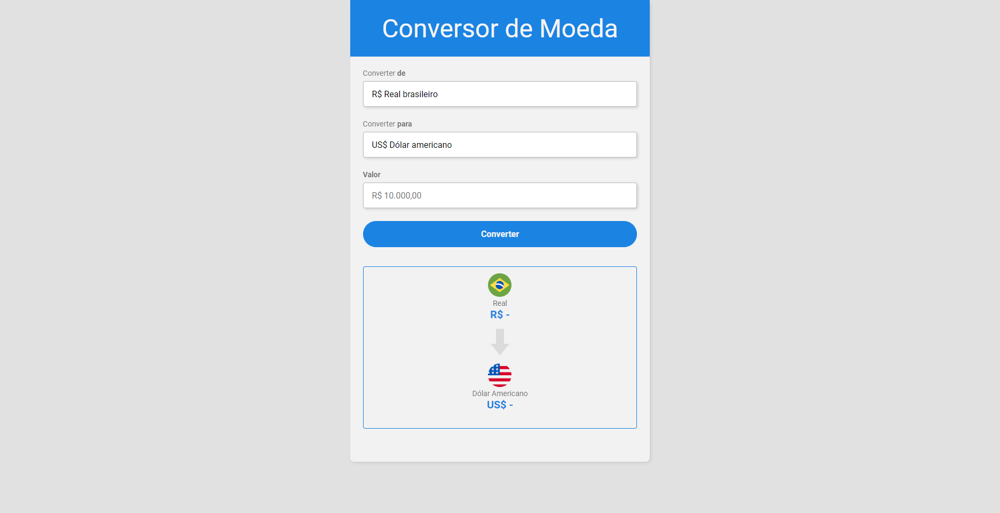

# Conversor de Moedas

> Aplicação de estudos JavaScript

Projeto desenvolvido durante os estudos de JavaScript Web do DevClub.

🔗 [Clique aqui para acessar](https://geovanarochamp.github.io/conversor-de-moedas/)

## 🛠️ Tecnologias

- HTML
- CSS
- JavaScript
- Git e Github

## 📲 Contato

geovana.rocha.martins@gmail.com
(34) 98407-2980